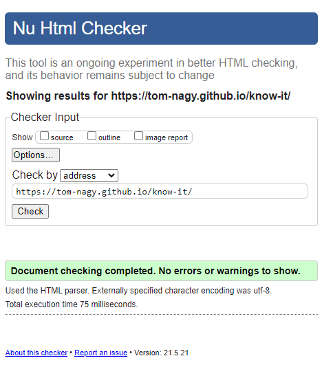
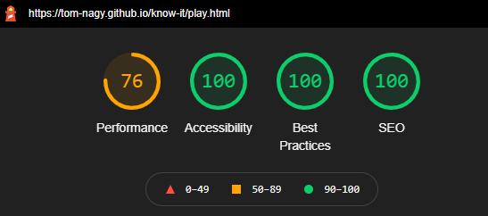
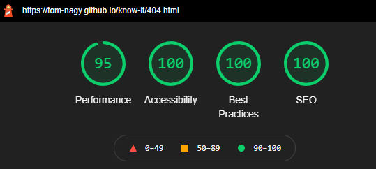

# **Know It**

**[:leftwards_arrow_with_hook: *README.md*](README.md)**

#### Visit the live Website : **[WEBSITE NAME](WEBSITE LINK)**.

# Testing

## Table of Content : 

* [Code Validation](#Code-Validation)
  * [W3C](#W3C)
  * [JSHint](#JSHint)
* [Lighthouse](#Lighthouse)
* [Cross Browsers Testing](#Cross-Browsers-Testing)
  * [Manual Testing](#Manual-Testing)
  * [Conclusions and Notations](#Conclusions-and-Notations)
* [User Stories Testing from UX section of the README.md](#User-Stories-Testing-from-UX-section-of-the-README.md)
  * [First Time User](#First-Time-User)
  * [Returning User](#Returning-User)
* [Further Testing](#Further-Testing)
* [Bugs](#Bugs)


## Code Validation

### W3C

W3C Markup Validation Service and W3C CSS Validation Service have been used to check all the pages of the website for semantic and syntax errors.
The results are positive and the code is valid.

* [W3C Markup Validation Service](https://validator.w3.org/)



* [W3C CSS Validation Service](https://jigsaw.w3.org/css-validator/)


[**:back:** *Table of Content* ](#Table-of-Content)

### JSHint

[JSHint](https://jshint.com/) was used to validate the JavaScript code for semantic and syntax errors. No warnings or error were found.  
The results are positive and the code is valid.

## Lighthouse

[Lighthouse](https://developers.google.com/web/tools/lighthouse/?utm_source=devtools) is a tool provided by Google Chrome DevTools and allows to identify the site performance, accessibility and user experience on Mobile and Desktop.  
All the pages from the website have been tested with Lighthouse.

They all show 100% score except for the performance for most pages. This is due to images sizes mostly and to the css file size. In the future devlopement of the website, considering a separation of the css between the play page and the rest of the website could be beneficial as well as creating different image sizes that would be loaded depending on the screen size.

* Home
  * 
  * 
* About
  * 
  * 
* Study
  * 
  * 
* Play
  * 
  * 
* Contact
  * 
  * 
* 404
  * 
  * 

[**:back:** *Table of Content* ](#Table-of-Content)

## Cross Browsers Testing

The website was tested on severals browsers (Google Chrome, Mozilla Firefox, Microsoft Edge, Safari and Opera) and shows good functionality across them all.  
Manual testing was executed on **all browsers** as shown in the following section.

### Manual Testing

The responsiveness of the website for different viewport sizes was tested by dragging the window up, down, left and right.  
The following tests have been executed severals times at different viewport breakpoints.

* Header
  * Click on the website **Logo**, and check if the link works and changes state when hovered and focused.
  * Click on the **menu button** to toggle the menu's links list and check if the button works and changes state when hovered and focused as well as all the links it contains.  

* Footer
  * Click on **the graduation cap icon** link and check if the link works and changes state when hovered, focused and opens in a different tab.
  * Click on **the cogs icon** link and check if the link works, when hovered and changes state focused and opens in a different tab.
  * Click on **the Pinterest icon** link and check if the link works, when hovered and changes state focused and opens in a different tab.

* index.html
  * Click on **About** navigation link (button), and check if the link works and changes state when hovered and focused.
  * Click on **Study** navigation link (button), and check if the link works and changes state when hovered and focused.
  * Click on **Play** navigation link (button), and check if the link works and changes state when hovered and focused.

* about.html
  * Click on **Study** navigation link (button), and check if the link works and changes state when hovered and focused.
  * Click on **Play** navigation link (button), and check if the link works and changes state when hovered and focused.
  * Click on **Contact** navigation link (button), and check if the link works and changes state when hovered and focused.

* study.html
  * Click on **Volcano** icon/button, and check if loads the content and changes state when hovered and focused.
  * Click on **Jungle** icon/button, and check if loads the content and changes state when hovered and focused.
  * Click on **Ocean** icon/button, and check if loads the content and changes state when hovered and focused.
  * Click on **Earth** icon/button, and check if loads the content and changes state when hovered and focused.
  * Click on **Play** navigation link (button), and check if the link works and changes state when hovered and focused.
  * Click on **the magnifiers** navigation link (button) in all the articles, and check if they toggle the content correctly and change state when hovered and focused.

* play.html
  * Click on **Study** navigation link (button), and check if the link works and changes state when hovered and focused.
  * Click on **How to play** button, and check if it toggles the rules and changes state when hovered and focused.
  * Click on **Volcano** icon/button, and check if it changes state when hovered and focused.
  * Click on **Jungle** icon/button, and check if it changes state when hovered and focused.
  * Click on **Ocean** icon/button, and check if it changes state when hovered and focused.
  * Click on **Earth** icon/button, and check if it changes state when hovered and focused.
  * Click on **Set Level** button, and check if it toggles the levels list and it changes state when hovered and focused.
  * Click on **Apprentice** and check if it changes state when hovered and focused and that it popultate the **Set Level** button when selected.
  * Click on **Scientist** and check if it changes state when hovered and focused and that it popultate the **Set Level** button when selected.
  * Click on **Genius** and check if it changes state when hovered and focused and that it popultate the **Set Level** button when selected.
  * Click on **Start** button and check if it works and loads the corresponding game defined by the selected subject and level.
  * Check if a modal pop-up if the settings are not set properly when clicking on **Start**.
  * Check if the achievements are being displayed at the bottom of the page upon receiving them.

* Game
  * Extensively check all the games features:
    * General Display.
    * Subject and level display.
    * New Game and Exit buttons.
    * Directional buttons.
    * Questions modals.
    * Question form when submitting without selection.
    * Answering right answer and getting the correct feedback.
    * Answering wrong answer and getting the correct feedback, displaying the right answer and displaying a strike on the game.
    * Receiving the correct feedback upon completing the game, receiving rewards when finishing with no strikes and getting score.

* contact.html

  * Try to submit the form without :
    * Filling **Your name** input and check if the form is valid and that an error message appears.
    * Filling **Your email address** input and check if the form is valid and that an error message appears.
    * Filling **Your message** input and check if the form is valid and that an error message appears.
    * Selecting a **Reason** and check if the form is valid and that an error message appears.

  * Try to submit the form given incorrect format input for :
    * Email and check if the form is valid and that an error message appears.

  * Send the form and check if :
    * A pop-up appears to give feedback upon submitting the form. One if the submission is successful and another one if it is not.
      * Check if the links available on those pop-ups works and change state when hovered and focused.
    * I reveived an email as a website owner delivered by EmailJS.
    * I received an email confirmation as a user.

  * Hovered and focused on the different input field and the button to check if they change state.

* 404.html
  * Click on **Back to home page** link (button) and check if the link works and changes state when hovered, focused.
  * Click on **What is a 404 error?** link and check if the link works, when hovered and changes state focused and opens in a different tab.
  * Click on **Report an issue** link and check if the link works, when hovered and changes state focused.

* Modals
  * Check if the modals appear and close correctly depending on their functionality.

[**:back:** *Table of Content* ](#Table-of-Content)

### Conclusions and Notations

All the features and functionality works very well across browers except for some features on safary and iOS.

Noted issues on iphones and iOS:

* The **menu button** does not render as intended and is a bit off.
* There are some unnoticeable design difference like the text-decoration of the subject and level on the game.
* Some differences are a bit more obvious and seem to be in relation to positioning, hover and focus effect.
  * The subjects buttons in the Study pages do not change backgound-color when ckicked. This is a positive feedback for the user to know what has been selected.
  * The directional buttons in the game display what i beleive is the focus and/or hover effect in an unexpected way.
  * In the modals, the closing button does not render nicely.

Noted general issue:

* The scrolling on smartphones can be a bit disturbing while on a modal because we can notice from time to time that something is happening in the background.

Although those issues do not change and/or impact on the functionality of the features, they have negative effects on the user experience.

## User Stories Testing from UX section of the README.md

### First Time User

1. As a first time user, I want the website to be appealing.
    * The website uses clean and spacious design.
    * The website applies all the accessibility protocols for an easy and good user experience for all. ===> PROOF OF ACCESSIBILITY FROM OTHER SOURCES !?


See [Lighthouse](https://github.com/Tom-Nagy/walking-around/blob/master/TESTING.md#Lighthouse) for accessibility results.

2. As a first time user, I want the navigation to be easy and intuitive.
    * The header and the footer are fixed respectively on the top and on the bottom of the page and always 
    accessible. So it is easy and quick to navigate.
    * The navigation menu is clear.
    * The current page is highlighted on medium and large screens to provide feedback location information to the user.


    * The current page replace the website name beside the logo on small screens to provide feedback location information to the user.


3. As a first time user, I want the content to be informative but not overwhelming.
    * The content is displayed per readable and short sections to provide the feeling that it is approachable and 
    not complicated. This is supported by the website design.
    
4. As a first time user, I want to understand immediately what is the website about without the need 
of looking for it.
    * The home page provide all the information that a new user need :
        * The heading gives the main information: "Ireland Best Walking Community" which includes location, 
        and what it is about.


        * Three paragraphs give extra information about the community spirit and goals.


5. As a first time user, I want to be able to apply for joining the Club.
    * In the footer a button/link ```Join Us !``` is always visible and accessible.
    * The form gives information (on the top) on what to except. After filling up the form, someone will contact 
    the user.
    * Additional information is given in the "About Us" section of The Club page on how to join.

### Returning User

6. As a returning user, I want to see when and where are the Club's meetings.
    * Club's meeting policy is explained in the "Meet up" section of the Activities page. 

7. As a returning user, I want to check out the different social media links for inspiration and ideas.
    * Relevant social media links are provided in the fixed footer and always accessible.

8. As a returning user, I want to get information about hiking.
    * A page is dedicated to Hiking Tips which include three main tips.
    * Each tip is downloadable in a pdf format.
    * Additional information is available at the bottom of each tip's section in a form of a link to external 
    websites.

[**:back:** *Table of Content* ](#Table-of-Content)

## Further Testing

* The website has been tested by fellow students, slack community, friends and family.
* All the issues raised have been addressed.

# Bugs

INCLUDE A BUGS SECTIONS IN RELATION TO TESTING AND NOT DEVELOPMENT !?

[**:back:** *Table of Content* ](#Table-of-Content)